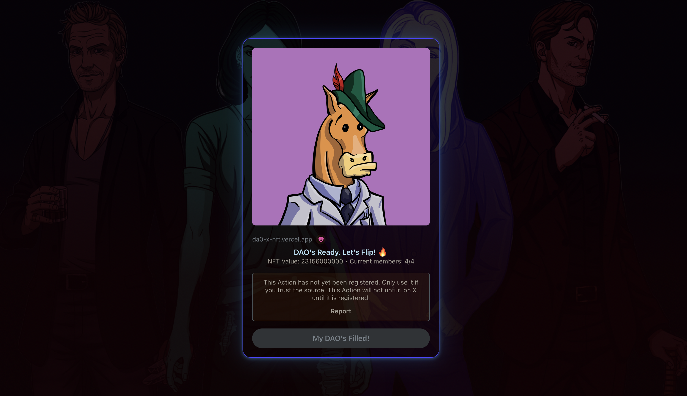

[]( https://blink-by-daoxnft.vercel.app)

## Getting Started

To run the development server:

```bash
npm run dev
# or
yarn dev
# or
pnpm dev
# or
bun dev
```

## View Your Action Blink

After starting the development server, you can view your Action Blink by opening your browser and navigating to
```bash
http://localhost:3000/?action=YOUR_SOLANA_ACTION
```

OR

Through Deployed Application, Access the live application by visiting:
```bash
https://blink-by-daoxnft.vercel.app/?action=YOUR_SOLANA_ACTION
```

<u>NOTE</u>: YOUR_SOLANA_ACTION should be encoded URL, for ex as follows

```bash
https://blink-by-daoxnft.vercel.app/?action=https%3A%2F%2Fda0-x-nft.vercel.app%2Fapi%2Fjoin-dao-action%3Fnft_id%3D7%26mbrs%3D4%26frcn%3D4
```